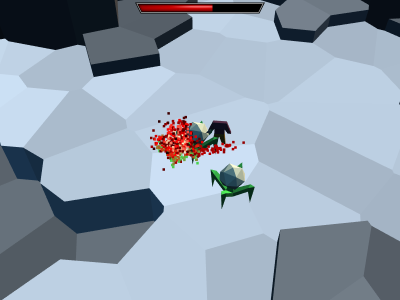

# I Want to Help Fight the Demon Overlord, but I’m Just an Intern!

“They are on a quest to save the world. You… are heading back to town to get them more potions.”

A game made for [JS13KGames 2019](http://js13kgames.com/) by Dietrich Epp (Twitter: [@DietrichEpp](https://twitter.com/DietrichEpp)). The goal was to create a game which runs in the browser and is no larger than 13 KiB compressed. And I did it!



## Play the Game

The GitHub releases page has the 13 KiB zip file attached to the v1.0 release. The file is called “InternApocalypse_JS13K.zip” and you can see it here: https://github.com/depp/intern-apocalypse/releases/tag/v1.0

If you want to play, just download, extract, and open it in your browser. It takes some time to load, be patient.

The soundtrack is available on SoundCloud:

- https://soundcloud.com/twoseventwo/sylvan-path

- https://soundcloud.com/twoseventwo/beyond-the-walls

## Development Notes and Technical Details

The game is written in TypeScript and uses WebGL for graphics. It has been tested on the following browsers and known to work:

- Safari, version 12.1.1
- Firefox, version 69
- Google Chrome, version 76

Some facts, in no particular order:

- There was a screen that said “The End” for when you beat the game, but it was integrated into the game because it pushed the file size slightly over the limit. Eventually you will just run out of things to do in the game.

- The houses do not have hitboxes. The NPC in town will wander into them.

- Assets are bundled into a `<script>` tag at the bottom of the HTML file. The audio data is loaded in a web worker.

- The final change to make the game fit 13 KiB was to switch `<html lang="en">` to `<html>`, which causes the tag to be removed entirely by the minifier.

## Building

To build the project,

```shell
yarn install
yarn run build
```

This will create two files:

- `build/index.html`: The game, in a self-contained HTML file.
- `build/InternApocalypse_JS13K.zip`: The game, packaged for submission to JS13K.

### Build script options

- `--config=release`: Build a non-minified version of the game, `build/InternApocalypse_JS13K.zip`.
- `yarn run build watch`: Rebuild continuously as sources change.
- `yarn run build serve`: Seve the game from a local development server, rebuilding the game as the sources change. This will also stream data files to the game as they change, so the results can be seen without reloading the game.

### Checking for Errors

To check the source code for TypeScript type errors,

```shell
yarn run check-game
yarn run check-tools
```

## Audio

Audio scripts are stored in the `audio` directory. You can compile and play them from the command line. For example:

```shell
yarn run audio audio/clang.lisp --play
```

### Audio script options

- `--disassemble`: Show the disassembled audio program.
- `--output=<file>`: Write audio to an output WAVE file.
- `--play`: Play the resulting audio.
- `--loop`: Play the audio repeatedly, reloading as the input changes.

## Models

The models are stored in the `model` directory. To convert a model to compact format,

```shell
yarn run model model/sword.txt
```

## License

Internship at the Apocalypse is released under the terms of the MIT License. See [LICENSE.txt](LICENSE.txt) for details.
